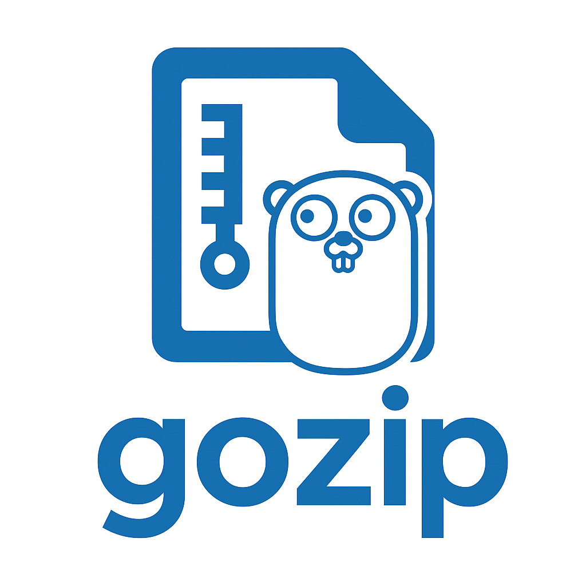

# gozip

🔍 **ZIP file analyzer in Go --- fast, simple, and extensible**



> "Unzipping is not just extracting --- it's *exploring*."

------------------------------------------------------------------------

## ✨ What is gozip?

**gozip** is a CLI tool written in Go that analyzes the contents of ZIP
files and provides a detailed summary of their internal structure,
compression ratios, sizes, and directory hierarchy.

Perfect for: - Quick inspection of compressed files
- Automation in pipelines
- Hands-on learning in Go
- Viewing what's inside without extracting

------------------------------------------------------------------------

## 🚀 Features

-   📂 *Full exploration* of ZIP contents
-   📊 Global metrics (file count, original vs compressed size)
-   🧭 Detailed listing with paths
-   ⚙️ Modular design: easy to extend
-   💨 Zero heavy dependencies

------------------------------------------------------------------------

## 🛠️ Installation

### Clone and build

``` bash
git clone https://github.com/cainlara/gozip.git
cd gozip
go build -o gozip main.go
```

### Install directly via Go

``` bash
go install github.com/cainlara/gozip@latest
```

------------------------------------------------------------------------

## ❓ FAQ

**Do I need to extract the ZIP to analyze it?**\
No --- gozip reads it directly.

**Does it work with large ZIP files?**\
Yes. Go handles streaming efficiently, though extremely large archives
(\>4GB) may require more memory.

**Will other formats be supported? (tar, rar, 7z)**\
`tar.gz` support is being considered.

------------------------------------------------------------------------

## 📄 License

This project is licensed under the **MIT License**.\
See the `LICENSE` file for details.

------------------------------------------------------------------------

## ⭐ Support the Project

If you enjoy gozip, please consider giving it a ⭐ on GitHub ---\
it helps the project grow and reach more developers!
